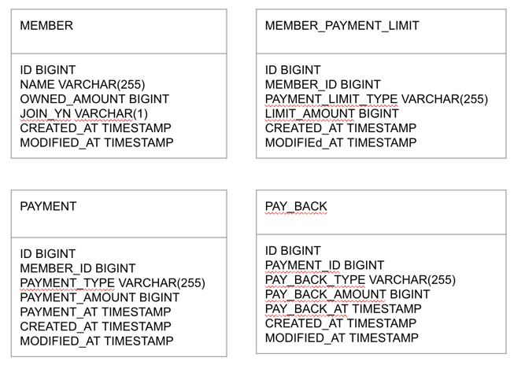

# subject

결제 및 결제에 대한 페이백 처리 과제

## Architecture

- MSA 환경 등 추후 다양한 Framework 사용 가능하기 때문에 Hexagonal Architecture를 사용하여 확장성 있는 아키텍처로 구성하였습니다.
- 이를 통해 Buisiness 로직에 대한 변경 가능성이 높은 Layer를 나누고 각 Layer에 대한 추상화를 높이기 위한 고민을 하여 개발을 하였습니다.

## 테이블 설계

- 회원 관리와 회원 한도 정보에 대하여 테이블을 분리하여 관리합니다.
  - 회원결제한도와 회원 테이블은 다대일 관계를 맺고 있습니다.
- 결제 테이블과 페이백 테이블은 분리하여 관리합니다.
  - 페이백과 결제는 다대일 관계를 맺고 있습니다.

## API 설계
- 결제 생성
    - |Method|URI|
      |:---|:---|
      |POST|/payments|
    - 요청 Body
      - |Name|Type|Description|
        |---|---|---|
        |memberId|Number|회원ID|
        |paymentAmount|Number|결제 금액|
    - 응답
      - |Name|Type|Description|
        |---|---|---|
        |status|Number|응답코드|
        |message|String|응답메세지|
        |body|Data|응답데이터|
        | ㄴ paymentId|Number|결제아이디|
        | ㄴ memberId|Number|결제아이디|
        | ㄴ paymentType|String|결제 타입|
        | ㄴ paymentAmount|Number|결제 금액|
    
- 결제 취소
    - |Method|URI|
      |:---|:---|
      |DELETE|/payments/{paymentId}|
    - 요청 Body
        - |Name|Type|Description|
          |---|---|---|
          |memberId|Number|회원ID|
    - 응답
        - |Name|Type|Description|
          |---|---|---|
          |status|Number|응답코드|
          |message|String|응답메세지|
          |body|Data|응답데이터|
          | ㄴ paymentId|Number|결제아이디|
          | ㄴ memberId|Number|결제아이디|
          | ㄴ paymentType|String|결제 타입|
          | ㄴ paymentAmount|Number|결제 금액|

- 페이백 요청
    - |Method|URI|
      |:---|:---|
      |POST|/payments/{paymentId}/pay-backs|
    - 요청 Body
        - |Name|Type|Description|
          |---|---|---|
          |memberId|Number|회원ID|
          |payBackRequestType|String|페이백 계산 타입|
    - 응답
        - |Name|Type|Description|
                  |---|---|---|
          |status|Number|응답코드|
          |message|String|응답메세지|
          |body|Data|응답데이터|
          | ㄴ payBackId|Number|페이백 아이디|
          | ㄴ payBackType|String|페이백 타입|
          | ㄴ payBackAmount|Number|페이백 금액|

- 페이백 취소
    - |Method|URI|
      |:---|:---|
      |POST|/payments/{paymentId}/pay-backs|
    - 요청 Body
        - |Name|Type|Description|
          |---|---|---|
          |memberId|Number|회원ID|
    - 응답
        - |Name|Type|Description|
          |---|---|---|
          |status|Number|응답코드|
          |message|String|응답메세지|
          |body|Data|응답데이터|
          | ㄴ payBackId|Number|페이백 아이디|
          | ㄴ payBackType|String|페이백 타입|
          | ㄴ payBackAmount|Number|페이백 금액|

- 응답 형태
  - 요청 처리 성공 시 status는 200으로 응답
  - 요청 실패에 대하여 한도 등 요청이 잘못되는 경우 400 응답
    - ExceptionCode.java 참고
  - Server 예외에 경우 500 응답
  
## 요구사항에 대한 해결 방법
- 결제 및 페이백은 회원이 소유하고 있는 금액에 대한 차감/증가로 처리했습니다.
- 회원 한도 설계
  - MEMBER 테이블에 1회, 1일, 30일 한도 필드를 추가하여 처리할 수 있지만 다른 타입의 한도가 추가되는 경우 테이블 컬럼추가가 필요합니다.
  - 그래서 MEMBER_PAYMENT_LIMIT 테이블에 한도 타입과 금액을 저장하는 형태로 개발하였습니다.
- 페이백에 대하여 계산하는 방법
  - 페이백 계산 방법은 임의로 정의하여 계산했습니다.
  - 페이백 계산 형태는 빈번하게 변경이 가능할 것으로 보여 Enum을 활용하여 확장성 있는 형태로 고민하였습니다.
    - PayBackRequestType.java 참고
- 5초의 제한시간 처리
  - Redis를 사용하였고, 결제/결제취소/페이백/페이백취소에 대한 요청을 모두 5초간의 제한시간을 두어야 하기 때문에 회원ID와 만료시간을 활용하여 해결하였습니다.
    - 로컬에서 사용하기 간편하도록 Embedded Redis 추가하였습니다.
  - Redis에 대한 처리는 boilerplate code로 반복하여 발생할 수 있고, 실제 비즈니스 로직과는 별개의 부가적인 정보라고 판단하여 Annotation과 AOP를 사용하여 처리할 수 있도록 하였습니다.
    - CacheLock.java, CacheLockAdapter.java 참고

## 발생 가능한 이슈
- Redis 장애 전파 대응 필요
  - Redis 장애 발생 시 5초 제한 처리에 대한 추가적인 처리가 필요합니다.
  - CircuitBreaker 나 CacheErrorHandler를 추가하여 Redis가 장애사항일 때 RDB를 조회하여 처리할 수 있는 로직을 추가 구현해야 합니다.
  - DB 조회하여 처리하는 경우 동시성 이슈가 발생할 수 있기 때문에 이에 대하여 DB Lock에 대한 고민이 필요합니다. 
- CacheLockAdapter 에서 Key값에 대한 SpEL을 활용한 처리
  - SpEL을 활용하여 키값을 가져오도록 했습니다. 이 때 String에 대한 타입 변환할 때 toString 메소드를 활용하였는데 오버라이딩이 되지 않는 경우 기대한 값과 다른 처리가 될 수 있습니다. 
- 한도 비교
  - MEMBER_PAYMENT_LIMIT 에 동일한 회원에 동일한 타입이 있는 경우, 첫번째 한도금액을 처리하도록 하였습니다.
  - 해당 형태가 여러개가 저장되는 경우에 대한 요구사항 정의가 추가 필요합니다.
- 페이백 계산 방법
  - 현재 고정 비율과 고정 금액에 대한 페이백 처리로 단순하게 계산하는 형태로 했습니다.
  - 조건에 페이백 한도 금액 등이 추가되어 페이백이 처리되지 않는 경우에 대한 추가적인 요구사항 정의와 설계가 필요합니다.